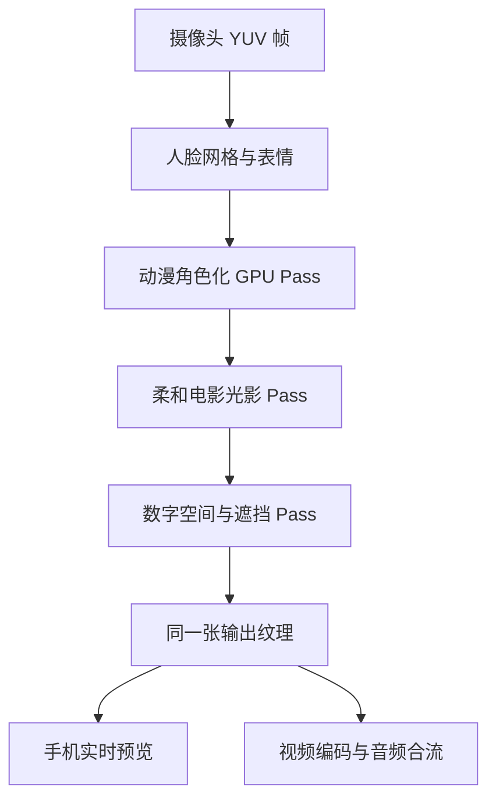

# 原生实时滤镜落地路线

## 成片必须经过同一条渲染链

如果光效只用 React Native 视图覆盖在相机预览上，录像文件里不会出现这些效果。第二阶段要实现的是 `src/filter/engineContract.ts` 中的 `NativeStyleRenderer`，并让渲染后的纹理直接进入编码器。

## 三个视觉 Pass

| Pass | 目标 | 关键方法 | 稳定性约束 |
|---|---|---|---|
| 动漫角色化 | 保留脸型、五官距离和发型辨识度，同时减少皮肤照片感 | MediaPipe 478 点面网格、分区色调、轮廓与眼部轻度重绘 | 参数做时间平滑；禁止逐帧生成式漂移 |
| 自然柔光 | 高光不过曝，阴影有暖冷层次，面部色彩柔和 | 人脸法线估计、双边滤波、肤色保护、柔和轮廓光 | 亮度随曝光缓动；避免“塑料脸”和硬边蒙版 |
| 数字空间 | 光效与人物有前后遮挡，不像贴纸 | 深度近似、脸/发/肩分割、粒子、体积光、HUD 透视 | 控制粒子密度；30 FPS 目标下 GPU 单帧预算小于 20 ms |

## 平台实现

| 平台 | 人脸跟踪 | 实时渲染 | 编码 |
|---|---|---|---|
| iOS | MediaPipe Tasks / VisionCamera Frame Output | Metal + Core Image 辅助 | AVAssetWriter，输入渲染后 CVPixelBuffer |
| Android | MediaPipe Tasks / VisionCamera Frame Output | OpenGL ES 3.1；高端机可选 Vulkan | MediaCodec + MediaMuxer，输入 Surface |

公共 TypeScript 层只管理参数、状态和设备能力降级；像素处理留在原生 GPU 层，避免把 1080p 帧复制到 JavaScript。

## 分档策略

- 高档机：1080p / 30 FPS，全套动漫、柔光、体积光与粒子。
- 中档机：1080p / 30 FPS，降低粒子与体积光采样。
- 低档机：720p / 24 或 30 FPS，保留角色化与关键轮廓光，关闭昂贵后处理。
- 温度或掉帧持续超阈值：自动降低数字光效采样，不改变本人相似度。

## 第二阶段验收条件

1. 预览和导出视频逐帧一致，不能只有预览叠层。
2. 说话、眨眼和快速转头时，轮廓无明显跳动或身份漂移。
3. 常见近三年中高端 iPhone / Android 真机可稳定连续录制 10 分钟。
4. `9:16` 与 `16:9` 都是实际编码尺寸和正确构图，不依赖播放器旋转猜测。
5. 原始人脸帧不上传；若未来加入云端增强，必须单独征得用户同意。
